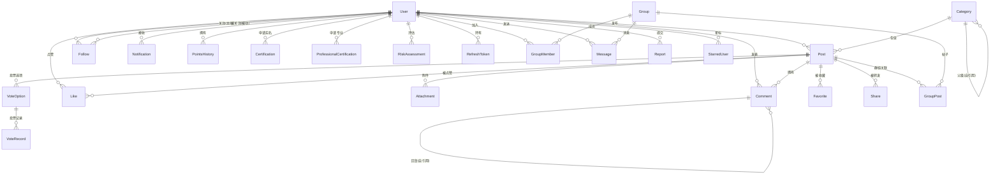

# 数据库设计文档 (Database Design)

> 项目：股票基金投资论坛
> 阶段：模块2 — AI辅助设计
> 迭代次数：3 轮
> 完整SQL脚本：database/schema.sql

---

## 迭代记录

| 迭代 | 日期 | 说明 |
|------|------|------|
| V1.0 | 2026-05-18 | 初始ER图设计，基于用户故事确定核心实体 |
| V1.1 | 2026-05-20 | 细化字段类型、索引和约束，补充全文索引 |
| V1.2 | 2026-05-22 | 最终版本，补充管理运营表和统计表 |

---

## 1. 数据库概览

| 项目 | 内容 |
|------|------|
| 数据库 | MySQL 8.0+（开发用 SQLite） |
| 字符集 | utf8mb4 |
| 排序规则 | utf8mb4_unicode_ci |
| 存储引擎 | InnoDB |
| 表总数 | 29 |
| 模块数 | 5 |

### 模块分布

| 模块 | 表数 | 说明 |
|------|------|------|
| 用户系统 | 6 | users, verification_codes, certifications, professional_certifications, risk_assessments, refresh_tokens |
| 内容系统 | 11 | categories, posts, comments, post_tags, attachments, likes, favorites, favorite_folders, shares, vote_options, vote_records |
| 社交系统 | 6 | follows, starred_users, groups, group_members, group_posts, messages |
| 运营管理 | 4 | reports, review_logs, ban_records, sensitive_words, compliance_rules |
| 统计日志 | 2 | daily_stats, user_activity_log, notifications, points_history |

---

## 2. V1.0 — 初始ER图设计

### 2.1 ER图（Mermaid格式）



### 2.2 核心实体关系

```
User (1) ──────< (N) Post         用户发布帖子
User (1) ──────< (N) Comment      用户发表评论
User (1) ──────< (N) Like         用户点赞
User (1) ──────< (N) Follow (follower_id)   用户关注别人
User (1) ──────< (N) Follow (following_id)  用户被关注
User (1) ──────< (N) GroupMember           用户加入群组
User (1) ──────< (N) Message               用户发送消息
User (1) ──────< (N) Notification          用户接收通知
Post (1) ──────< (N) Comment  帖子→评论
Post (1) ──────< (N) Like    帖子→点赞
Post (1) ──────< (N) Attachment 帖子→附件
Post (1) ──────< (N) VoteOption  帖子→投票选项
Category (1) ──< (N) Post     板块→帖子
Category (1) ──< (N) Category (parent_id) 板块自引用（树形）
Comment (1) ───< (N) Comment (parent_id)  评论自引用（楼中楼）
Group (1) ─────< (N) GroupMember  群组→成员
Group (1) ─────< (N) GroupPost    群组→帖子
```

---

## 3. V1.1 — 表结构细化

### 3.1 用户系统（5表）

#### users — 用户账户
```sql
CREATE TABLE users (
    id              INT PRIMARY KEY AUTO_INCREMENT,
    phone           VARCHAR(20) UNIQUE,
    email           VARCHAR(255) UNIQUE,
    password_hash   VARCHAR(255) NOT NULL,
    nickname        VARCHAR(50) NOT NULL,
    avatar_url      VARCHAR(500),
    bio             TEXT,
    role            ENUM('user','admin') DEFAULT 'user',
    status          ENUM('active','banned','disabled') DEFAULT 'active',
    auth_level      ENUM('basic','verified','real_name','professional') DEFAULT 'basic',
    risk_level      ENUM('conservative','moderate','aggressive','radical'),
    points          INT DEFAULT 0,
    level           INT DEFAULT 1,
    tags            JSON,
    favorite_markets JSON,
    risk_preference VARCHAR(50),
    privacy_settings JSON,
    register_type   ENUM('phone','email') DEFAULT 'phone',
    created_at      DATETIME DEFAULT CURRENT_TIMESTAMP,
    updated_at      DATETIME DEFAULT CURRENT_TIMESTAMP ON UPDATE CURRENT_TIMESTAMP,
    INDEX idx_users_status (status),
    INDEX idx_users_points (points DESC)
);
```

#### refresh_tokens — 刷新令牌
```sql
CREATE TABLE refresh_tokens (
    id          INT PRIMARY KEY AUTO_INCREMENT,
    user_id     INT NOT NULL,
    token_hash  VARCHAR(64) NOT NULL,
    expires_at  DATETIME NOT NULL,
    is_revoked  BOOLEAN DEFAULT FALSE,
    revoked_at  DATETIME,
    created_at  DATETIME DEFAULT CURRENT_TIMESTAMP,
    FOREIGN KEY (user_id) REFERENCES users(id),
    INDEX idx_refresh_tokens_hash (token_hash),
    INDEX idx_refresh_tokens_user (user_id)
);
```

#### professional_certifications — 专业认证
```sql
CREATE TABLE professional_certifications (
    id              INT PRIMARY KEY AUTO_INCREMENT,
    user_id         INT NOT NULL,
    qualification_type VARCHAR(100) NOT NULL,
    certificate_file   VARCHAR(500) NOT NULL,
    description        TEXT,
    status          ENUM('pending','approved','rejected') DEFAULT 'pending',
    reviewed_by     INT,
    review_comment  TEXT,
    created_at      DATETIME DEFAULT CURRENT_TIMESTAMP,
    reviewed_at     DATETIME,
    FOREIGN KEY (user_id) REFERENCES users(id)
);
```

#### certifications — 实名认证
```sql
CREATE TABLE certifications (
    id              INT PRIMARY KEY AUTO_INCREMENT,
    user_id         INT NOT NULL,
    real_name       VARCHAR(100) NOT NULL,
    id_number       VARCHAR(255) NOT NULL,  -- AES加密存储
    id_photo_front  VARCHAR(500),
    id_photo_back   VARCHAR(500),
    status          ENUM('pending','approved','rejected') DEFAULT 'pending',
    reviewed_by     INT,
    review_comment  TEXT,
    created_at      DATETIME DEFAULT CURRENT_TIMESTAMP,
    reviewed_at     DATETIME,
    FOREIGN KEY (user_id) REFERENCES users(id)
);
```

#### risk_assessments — 风险评估
```sql
CREATE TABLE risk_assessments (
    id          INT PRIMARY KEY AUTO_INCREMENT,
    user_id     INT NOT NULL,
    answers     JSON NOT NULL,
    score       INT NOT NULL,
    level       ENUM('conservative','moderate','aggressive','radical') NOT NULL,
    suggestion  TEXT,
    created_at  DATETIME DEFAULT CURRENT_TIMESTAMP,
    FOREIGN KEY (user_id) REFERENCES users(id)
);
```

### 3.2 内容系统（11表）

#### categories — 板块
```sql
CREATE TABLE categories (
    id          INT PRIMARY KEY AUTO_INCREMENT,
    name        VARCHAR(50) NOT NULL,
    description VARCHAR(255),
    parent_id   INT,
    sort_order  INT DEFAULT 0,
    is_active   BOOLEAN DEFAULT TRUE,
    created_at  DATETIME DEFAULT CURRENT_TIMESTAMP,
    FOREIGN KEY (parent_id) REFERENCES categories(id),
    INDEX idx_categories_parent (parent_id),
    INDEX idx_categories_sort (sort_order)
);
```

#### posts — 帖子
```sql
CREATE TABLE posts (
    id              INT PRIMARY KEY AUTO_INCREMENT,
    user_id         INT NOT NULL,
    category_id     INT NOT NULL,
    title           VARCHAR(200) NOT NULL,
    content         LONGTEXT,
    post_type       ENUM('normal','longtext','poll','realtime') DEFAULT 'normal',
    status          ENUM('published','review','banned','draft') DEFAULT 'published',
    is_essence      BOOLEAN DEFAULT FALSE,
    is_live         BOOLEAN DEFAULT FALSE,
    cover_image     VARCHAR(500),
    tags            JSON,
    view_count      INT DEFAULT 0,
    like_count      INT DEFAULT 0,
    comment_count   INT DEFAULT 0,
    collect_count   INT DEFAULT 0,
    share_count     INT DEFAULT 0,
    created_at      DATETIME DEFAULT CURRENT_TIMESTAMP,
    updated_at      DATETIME DEFAULT CURRENT_TIMESTAMP ON UPDATE CURRENT_TIMESTAMP,
    FOREIGN KEY (user_id) REFERENCES users(id),
    FOREIGN KEY (category_id) REFERENCES categories(id),
    INDEX idx_posts_user (user_id),
    INDEX idx_posts_category (category_id),
    INDEX idx_posts_status (status),
    INDEX idx_posts_created (created_at DESC),
    INDEX idx_posts_hot (like_count DESC, comment_count DESC),
    FULLTEXT INDEX ft_posts (title, content)
);
```

#### comments — 评论
```sql
CREATE TABLE comments (
    id          INT PRIMARY KEY AUTO_INCREMENT,
    post_id     INT NOT NULL,
    user_id     INT NOT NULL,
    parent_id   INT,
    reply_to_id INT,
    content     TEXT NOT NULL,
    status      ENUM('published','review','banned') DEFAULT 'published',
    like_count  INT DEFAULT 0,
    created_at  DATETIME DEFAULT CURRENT_TIMESTAMP,
    FOREIGN KEY (post_id) REFERENCES posts(id),
    FOREIGN KEY (user_id) REFERENCES users(id),
    FOREIGN KEY (parent_id) REFERENCES comments(id),
    INDEX idx_comments_post (post_id),
    INDEX idx_comments_parent (parent_id)
);
```

#### likes — 点赞（多态）
```sql
CREATE TABLE likes (
    id          INT PRIMARY KEY AUTO_INCREMENT,
    user_id     INT NOT NULL,
    target_type ENUM('post','comment') NOT NULL,
    target_id   INT NOT NULL,
    created_at  DATETIME DEFAULT CURRENT_TIMESTAMP,
    FOREIGN KEY (user_id) REFERENCES users(id),
    UNIQUE KEY uk_likes (user_id, target_type, target_id)
);
```

#### favorites — 收藏
```sql
CREATE TABLE favorites (
    id          INT PRIMARY KEY AUTO_INCREMENT,
    user_id     INT NOT NULL,
    post_id     INT NOT NULL,
    folder_id   INT,
    created_at  DATETIME DEFAULT CURRENT_TIMESTAMP,
    FOREIGN KEY (user_id) REFERENCES users(id),
    FOREIGN KEY (post_id) REFERENCES posts(id),
    UNIQUE KEY uk_favorites (user_id, post_id)
);
```

#### vote_options — 投票选项
```sql
CREATE TABLE vote_options (
    id          INT PRIMARY KEY AUTO_INCREMENT,
    post_id     INT NOT NULL,
    label       VARCHAR(100) NOT NULL,
    vote_count  INT DEFAULT 0,
    sort_order  INT DEFAULT 0,
    FOREIGN KEY (post_id) REFERENCES posts(id)
);
```

### 3.3 社交系统（6表）

#### follows — 关注
```sql
CREATE TABLE follows (
    follower_id  INT NOT NULL,
    following_id INT NOT NULL,
    created_at   DATETIME DEFAULT CURRENT_TIMESTAMP,
    PRIMARY KEY (follower_id, following_id),
    FOREIGN KEY (follower_id) REFERENCES users(id),
    FOREIGN KEY (following_id) REFERENCES users(id)
);
```

#### groups — 群组
```sql
CREATE TABLE groups (
    id            INT PRIMARY KEY AUTO_INCREMENT,
    owner_id      INT NOT NULL,
    name          VARCHAR(100) NOT NULL,
    description   TEXT,
    avatar_url    VARCHAR(500),
    is_public     BOOLEAN DEFAULT TRUE,
    need_approval BOOLEAN DEFAULT FALSE,
    member_count  INT DEFAULT 0,
    created_at    DATETIME DEFAULT CURRENT_TIMESTAMP,
    updated_at    DATETIME DEFAULT CURRENT_TIMESTAMP ON UPDATE CURRENT_TIMESTAMP,
    FOREIGN KEY (owner_id) REFERENCES users(id)
);
```

#### group_members — 群组成员
```sql
CREATE TABLE group_members (
    id          INT PRIMARY KEY AUTO_INCREMENT,
    group_id    INT NOT NULL,
    user_id     INT NOT NULL,
    role        ENUM('owner','admin','member') DEFAULT 'member',
    status      ENUM('pending','approved','rejected') DEFAULT 'approved',
    joined_at   DATETIME DEFAULT CURRENT_TIMESTAMP,
    FOREIGN KEY (group_id) REFERENCES groups(id),
    FOREIGN KEY (user_id) REFERENCES users(id),
    UNIQUE KEY uk_group_member (group_id, user_id)
);
```

#### messages — 消息
```sql
CREATE TABLE messages (
    id          INT PRIMARY KEY AUTO_INCREMENT,
    sender_id   INT NOT NULL,
    receiver_id INT,
    group_id    INT,
    content     TEXT NOT NULL,
    msg_type    ENUM('text','image','file') DEFAULT 'text',
    created_at  DATETIME DEFAULT CURRENT_TIMESTAMP,
    FOREIGN KEY (sender_id) REFERENCES users(id),
    FOREIGN KEY (group_id) REFERENCES groups(id),
    INDEX idx_messages_receiver (receiver_id),
    INDEX idx_messages_group (group_id)
);
```

#### notifications — 通知
```sql
CREATE TABLE notifications (
    id          INT PRIMARY KEY AUTO_INCREMENT,
    user_id     INT NOT NULL,
    type        ENUM('follow','group_invite','group_join_request',
                'group_approved','group_rejected','new_message',
                'new_group_message','mention','system','system_alert') NOT NULL,
    title       VARCHAR(200),
    content     TEXT,
    target      VARCHAR(50),
    target_id   INT,
    sender_id   INT,
    is_read     BOOLEAN DEFAULT FALSE,
    created_at  DATETIME DEFAULT CURRENT_TIMESTAMP,
    FOREIGN KEY (user_id) REFERENCES users(id),
    INDEX idx_notifications_user (user_id, is_read)
);
```

### 3.4 运营管理（5表）

#### sensitive_words — 敏感词
```sql
CREATE TABLE sensitive_words (
    id          INT PRIMARY KEY AUTO_INCREMENT,
    word        VARCHAR(100) NOT NULL,
    level       ENUM('block','review','warn') NOT NULL,
    category    VARCHAR(50),
    is_active   BOOLEAN DEFAULT TRUE,
    created_at  DATETIME DEFAULT CURRENT_TIMESTAMP
);
```

#### reports — 举报
```sql
CREATE TABLE reports (
    id            INT PRIMARY KEY AUTO_INCREMENT,
    reporter_id   INT NOT NULL,
    target_type   ENUM('post','comment','user') NOT NULL,
    target_id     INT NOT NULL,
    reason        VARCHAR(200) NOT NULL,
    description   TEXT,
    status        ENUM('pending','resolved','dismissed') DEFAULT 'pending',
    handled_by    INT,
    created_at    DATETIME DEFAULT CURRENT_TIMESTAMP,
    resolved_at   DATETIME,
    FOREIGN KEY (reporter_id) REFERENCES users(id)
);
```

#### ban_records — 封禁记录
```sql
CREATE TABLE ban_records (
    id          INT PRIMARY KEY AUTO_INCREMENT,
    user_id     INT NOT NULL,
    banned_by   INT NOT NULL,
    reason      VARCHAR(500) NOT NULL,
    duration_hours INT,
    banned_at   DATETIME DEFAULT CURRENT_TIMESTAMP,
    unbanned_at DATETIME,
    FOREIGN KEY (user_id) REFERENCES users(id)
);
```

### 3.5 统计与日志（2表）

#### daily_stats — 每日统计
```sql
CREATE TABLE daily_stats (
    id              INT PRIMARY KEY AUTO_INCREMENT,
    date            DATE NOT NULL UNIQUE,
    dau             INT DEFAULT 0,
    new_users       INT DEFAULT 0,
    new_posts       INT DEFAULT 0,
    new_comments    INT DEFAULT 0,
    new_likes       INT DEFAULT 0,
    new_reports     INT DEFAULT 0,
    created_at      DATETIME DEFAULT CURRENT_TIMESTAMP
);
```

#### points_history — 积分历史
```sql
CREATE TABLE points_history (
    id              INT PRIMARY KEY AUTO_INCREMENT,
    user_id         INT NOT NULL,
    points_change   INT NOT NULL,
    reason          VARCHAR(50) NOT NULL,
    reference_type  VARCHAR(50),
    reference_id    INT,
    created_at      DATETIME DEFAULT CURRENT_TIMESTAMP,
    FOREIGN KEY (user_id) REFERENCES users(id),
    INDEX idx_points_user (user_id)
);
```

---

## 4. V1.2 — 最终设计补充

### 4.1 完整ER图

```mermaid
erDiagram
    %% ===== 用户系统 =====
    User {
        int id PK
        varchar phone UK
        varchar email UK
        varchar password_hash
        varchar nickname
        varchar avatar_url
        text bio
        enum role "user|admin"
        enum status "active|banned|disabled"
        enum auth_level "basic|verified|real_name|professional"
        enum risk_level "conservative|moderate|aggressive|radical"
        int points "default 0"
        int level "default 1"
        json tags
        json favorite_markets
        json privacy_settings
        enum register_type "phone|email"
        datetime created_at
        datetime updated_at
    }

    RefreshToken {
        int id PK
        int user_id FK
        varchar token_hash
        datetime expires_at
        boolean is_revoked
        datetime revoked_at
        datetime created_at
    }

    Certification {
        int id PK
        int user_id FK
        varchar real_name
        varchar id_number "AES encrypted"
        varchar id_photo_front
        varchar id_photo_back
        enum status "pending|approved|rejected"
        datetime created_at
    }

    RiskAssessment {
        int id PK
        int user_id FK
        json answers
        int score
        enum level
        text suggestion
        datetime created_at
    }

    ProfessionalCertification {
        int id PK
        int user_id FK
        varchar qualification_type
        varchar certificate_file
        text description
        enum status "pending|approved|rejected"
        datetime created_at
    }

    %% ===== 内容系统 =====
    Category {
        int id PK
        varchar name
        varchar description
        int parent_id FK "self-ref"
        int sort_order
        boolean is_active
        datetime created_at
    }

    Post {
        int id PK
        int user_id FK
        int category_id FK
        varchar title
        longtext content
        enum post_type "normal|longtext|poll|realtime"
        enum status "published|review|banned|draft"
        boolean is_essence
        boolean is_live
        varchar cover_image
        json tags
        int view_count
        int like_count
        int comment_count
        int collect_count
        int share_count
        datetime created_at
        datetime updated_at
        fulltext ft_posts "title,content"
    }

    Comment {
        int id PK
        int post_id FK
        int user_id FK
        int parent_id FK "self-ref"
        int reply_to_id
        text content
        enum status "published|review|banned"
        int like_count
        datetime created_at
    }

    Like {
        int id PK
        int user_id FK
        enum target_type "post|comment"
        int target_id
        datetime created_at
        unique uk_likes "user_id,target_type,target_id"
    }

    Attachment {
        int id PK
        int post_id FK
        varchar file_name
        varchar file_url
        int file_size
        varchar file_type
        datetime created_at
    }

    VoteOption {
        int id PK
        int post_id FK
        varchar label
        int vote_count
        int sort_order
    }

    VoteRecord {
        int id PK
        int option_id FK
        int user_id FK
        datetime created_at
        unique uk_vote "user_id,option_id"
    }

    Favorite {
        int id PK
        int user_id FK
        int post_id FK
        int folder_id FK
        datetime created_at
        unique uk_fav "user_id,post_id"
    }

    Share {
        int id PK
        int user_id FK
        int post_id FK
        varchar content
        enum share_type "timeline|message|group"
        datetime created_at
    }

    %% ===== 社交系统 =====
    Follow {
        int follower_id PK,FK
        int following_id PK,FK
        datetime created_at
    }

    StarredUser {
        int id PK
        int user_id FK
        int starred_user_id FK
        datetime created_at
        unique uk_starred "user_id,starred_user_id"
    }

    Group {
        int id PK
        int owner_id FK
        varchar name
        text description
        varchar avatar_url
        boolean is_public
        boolean need_approval
        int member_count
        datetime created_at
        datetime updated_at
    }

    GroupMember {
        int id PK
        int group_id FK
        int user_id FK
        enum role "owner|admin|member"
        enum status "pending|approved|rejected"
        datetime joined_at
        unique uk_gm "group_id,user_id"
    }

    GroupPost {
        int id PK
        int group_id FK
        int post_id FK
        datetime created_at
        unique uk_gp "group_id,post_id"
    }

    Message {
        int id PK
        int sender_id FK
        int receiver_id
        int group_id FK
        text content
        enum msg_type "text|image|file"
        datetime created_at
    }

    Notification {
        int id PK
        int user_id FK
        enum type "follow|group_invite|group_join_request|group_approved|group_rejected|new_message|new_group_message|mention|system|system_alert"
        varchar title
        text content
        varchar target
        int target_id
        int sender_id
        boolean is_read
        datetime created_at
    }

    %% ===== 运营管理 =====
    SensitiveWord {
        int id PK
        varchar word
        enum level "block|review|warn"
        varchar category
        boolean is_active
        datetime created_at
    }

    Report {
        int id PK
        int reporter_id FK
        enum target_type "post|comment|user"
        int target_id
        varchar reason
        text description
        enum status "pending|resolved|dismissed"
        int handled_by
        datetime created_at
        datetime resolved_at
    }

    ReviewLog {
        int id PK
        int reviewer_id FK
        varchar target_type
        int target_id
        enum action "approved|rejected"
        text comment
        datetime created_at
    }

    BanRecord {
        int id PK
        int user_id FK
        int banned_by FK
        varchar reason
        int duration_hours
        datetime banned_at
        datetime unbanned_at
    }

    PointsHistory {
        int id PK
        int user_id FK
        int points_change
        varchar reason
        varchar reference_type
        int reference_id
        datetime created_at
    }

    DailyStat {
        int id PK
        date date UK
        int dau
        int new_users
        int new_posts
        int new_comments
        int new_likes
        int new_reports
        datetime created_at
    }

    UserActivityLog {
        int id PK
        int user_id FK
        varchar action
        varchar target_type
        int target_id
        json details
        datetime created_at
    }

    %% ===== 关系定义 =====
    User ||--o{ Post : ""
    User ||--o{ Comment : ""
    User ||--o{ Like : ""
    User ||--o{ Follow : "as follower"
    User ||--o{ Follow : "as following"
    User ||--o{ Notification : ""
    User ||--o{ PointsHistory : ""
    User ||--o{ RefreshToken : ""
    User ||--o{ Certification : ""
    User ||--o{ RiskAssessment : ""
    User ||--o{ GroupMember : ""
    User ||--o{ Message : "as sender"
    User ||--o{ Report : "as reporter"
    User ||--o{ Group : "as owner"
    Category ||--o{ Category : "parent"
    Category ||--o{ Post : ""
    Post ||--o{ Comment : ""
    Post ||--o{ Like : ""
    Post ||--o{ Attachment : ""
    Post ||--o{ VoteOption : ""
    Post ||--o{ Favorite : ""
    Post ||--o{ Share : ""
    Comment ||--o{ Comment : "parent"
    VoteOption ||--o{ VoteRecord : ""
    Group ||--o{ GroupMember : ""
    Group ||--o{ GroupPost : ""
    Group ||--o{ Message : ""
```



### 4.2 索引策略

| 表 | 索引 | 类型 | 目的 |
|----|------|------|------|
| users | phone, email | UNIQUE | 登录查重 |
| users | status | INDEX | 按状态筛选 |
| users | points DESC | INDEX | 积分排行榜 |
| posts | (user_id, created_at) | INDEX | 用户帖子列表 |
| posts | (category_id, created_at) | INDEX | 板块帖子列表 |
| posts | (title, content) | FULLTEXT | 全文搜索 |
| posts | (like_count DESC) | INDEX | 热榜排序 |
| comments | (post_id, created_at) | INDEX | 帖子评论列表 |
| likes | (user_id, target_type, target_id) | UNIQUE | 防重复点赞 |
| notifications | (user_id, is_read) | INDEX | 用户通知列表 |
| follows | (follower_id, following_id) | PK | 关注关系 |
| group_members | (group_id, user_id) | UNIQUE | 防重复加入 |

### 4.3 数据完整性约束

| 约束 | 说明 |
|------|------|
| 外键 | 所有关联表设置外键约束，确保引用完整性 |
| 唯一约束 | 手机号、邮箱、点赞、收藏、关注等防止重复 |
| 级联删除 | posts→comments（帖子删除时评论一并删除） |
| NOT NULL | 关键字段不允许为空（如密码哈希、标题） |
| 默认值 | 计数类字段默认0，状态字段默认最常用值 |

### 4.4 数据库设计迭代记录

| 版本 | 变更内容 |
|------|---------|
| V1.0 | 初始设计：User, Post, Comment, Category, Follow, Group 等核心表 |
| V1.1 | 增加：professional_certifications, vote_options, vote_records, points_history, user_activity_log |
| V1.1 | 修改：posts 表增加 post_type, is_live, cover_image 字段 |
| V1.1 | 增加：全文索引 ft_posts 支持帖子搜索 |
| V1.1 | 修改：comments 表增加 parent_id 和 reply_to_id 支持楼中楼 |
| V1.2 | 增加：notifications 表独立，通知类型枚举 |
| V1.2 | 修改：users 表增加 privacy_settings JSON字段 |
| V1.2 | 增加：daily_stats 统计表 |
| V1.2 | 优化：所有表添加 created_at/updated_at 时间戳 |
